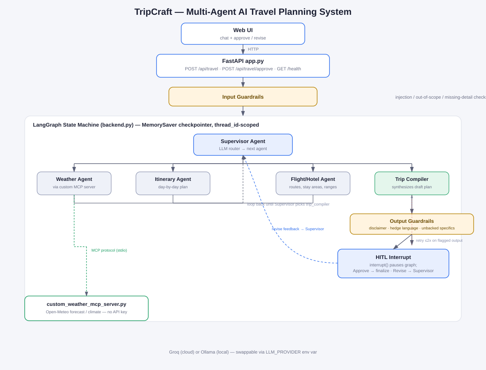
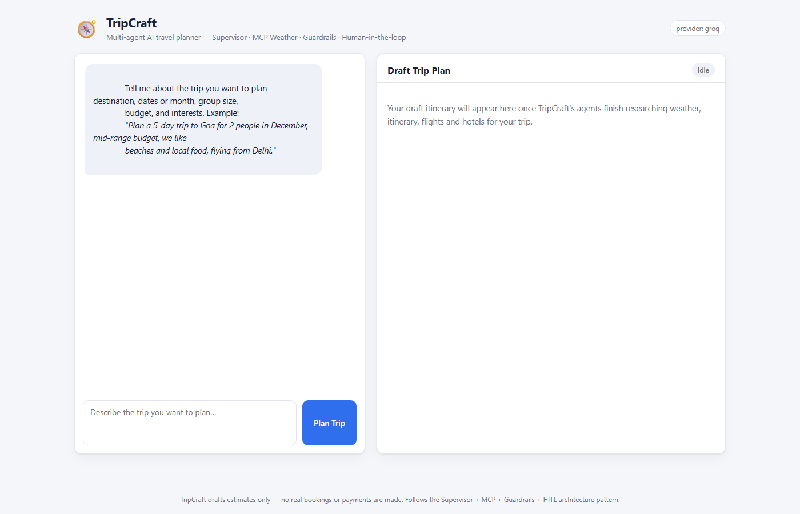
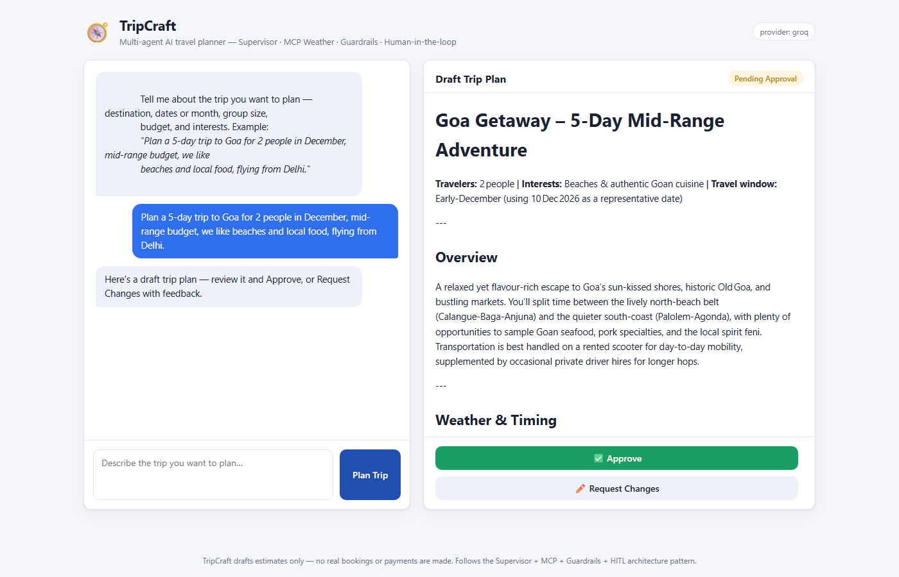
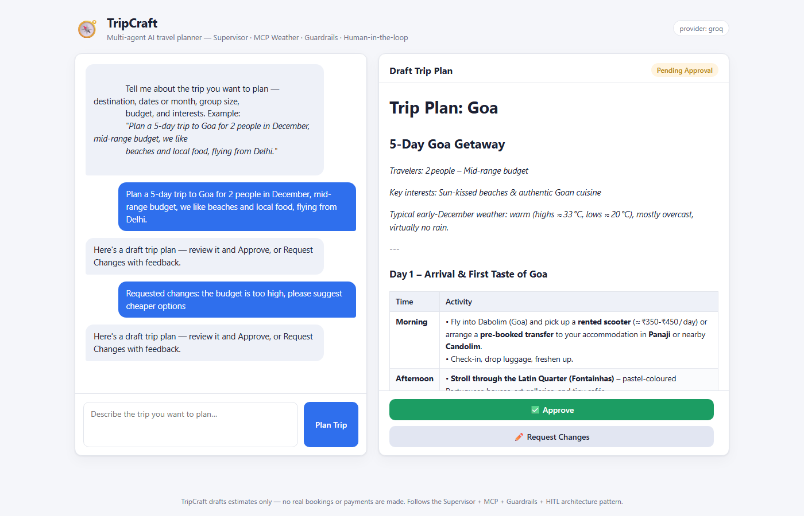
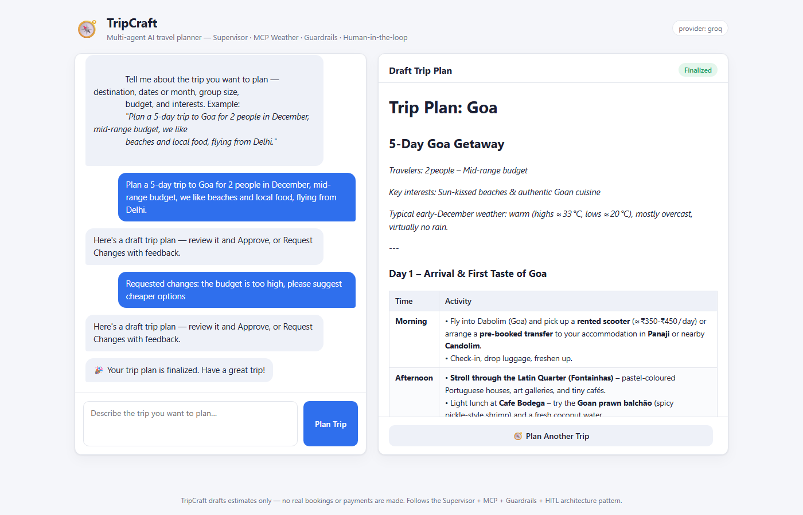

# TripCraft — Multi-Agent AI Travel Planning System

TripCraft is a multi-agent AI travel planner: describe a trip in plain English and a
**Supervisor agent** routes the request across specialized agents (Weather, Itinerary,
Flight/Hotel) that call a **live weather MCP server**, a **Trip Compiler** synthesizes their
output into one draft plan, **input/output guardrails** run as real code (not just prompt
wording) on the way in and out, and nothing is finalized until a human **approves or requests
changes** through a genuine LangGraph **human-in-the-loop interrupt** — not a fake client-side
confirmation.



---

## Why this architecture

- **Supervisor** — an LLM-driven router decides which agent runs next based on what the
  conversation state is actually missing, instead of a hardcoded pipeline. This is what makes
  the system "multi-agent" rather than one long prompt: each agent has a narrow job description,
  and the Supervisor composes them per-request (and again, differently, on every revision).
- **MCP (Model Context Protocol)** — the Weather Agent doesn't call an HTTP API directly; it
  talks to `custom_weather_mcp_server.py` over the real MCP stdio protocol, the same way a
  general-purpose MCP client (Claude Desktop, etc.) would. That keeps the tool genuinely
  decoupled and swappable, and is the piece of this project that maps most directly onto how
  production agent systems are wired to external tools today.
- **Guardrails** — LLMs will happily invent a flight number or promise "guaranteed
  availability" if you let them. Guardrails are implemented as explicit graph nodes with unit
  tests, not just system-prompt instructions, so a request that tries to jailbreak the
  assistant or asks it to actually charge a card is rejected deterministically, and an output
  that fabricates specifics or overstates certainty is caught and fixed before a human ever
  sees it.
- **HITL (Human-in-the-Loop)** — travel plans involve real money and real dates; the system
  should never present something as final without a person signing off. LangGraph's
  `interrupt()` genuinely pauses graph execution and persists state via a checkpointer, so the
  approve/revise loop survives across separate HTTP requests keyed by `thread_id` — it's not a
  UI trick layered on top of a stateless backend.

---

## Architecture

```
Web UI (chat + approve/revise)
        │ HTTP
FastAPI app.py — POST /api/travel · POST /api/travel/approve · GET /health
        │
Input Guardrails (injection / out-of-scope / missing-detail checks)
        │
┌───────────────────── LangGraph state machine (backend.py) ─────────────────────┐
│                                                                                  │
│                         ┌─────────────────┐                                    │
│                    ┌───▶│ Supervisor Agent│◀───┐                               │
│                    │    └───┬──┬──┬───────┘    │  loop until Supervisor        │
│                    │        │  │  │            │  picks trip_compiler          │
│         ┌──────────┘   ┌────┘  │  └───────┐    │                               │
│         ▼               ▼      ▼          ▼    │                               │
│   Weather Agent  Itinerary Agent  Flight/Hotel Agent   Trip Compiler            │
│   (MCP tool)                                            │                       │
│                                                          ▼                       │
│                                             Output Guardrails (retry ≤2x)        │
│                                                          │                       │
│                                                          ▼                       │
│                                   HITL interrupt() — Approve → finalize          │
│                                                     Revise  → back to Supervisor │
└──────────────────────────────────────────────────────────────────────────────────┘
        │ MCP protocol (stdio)
custom_weather_mcp_server.py — Open-Meteo forecast / historical-climate (no API key)
```

See `demo/architecture.svg` for the full diagram.

---

## Agents

| Agent | Responsibility | Tools |
|---|---|---|
| **Supervisor** | Reads state, decides which agent runs next (and, on a revision, which agents the feedback actually concerns) | none — routing only |
| **Weather Agent** | Forecast (trips ≤16 days out) or typical-climate estimate (further out, using last year's data for the same dates); flags heat/cold/rain risk | MCP: `custom_weather_mcp_server` |
| **Itinerary Agent** | Day-by-day plan matching trip length, group size, budget and interests | none |
| **Flight/Hotel Agent** | Route/timing and accommodation type/area suggestions with a rough price range — never a specific flight number or hotel name | none (explicitly estimates, not a live search) |
| **Trip Compiler** | Synthesizes everything into one Markdown plan with a budget total and an assumptions section | none |

---

## Guardrails — what's actually checked

**Input** (`guardrails.py::run_input_guardrail`, before the Supervisor runs):
- Prompt-injection patterns ("ignore previous instructions", "reveal your system prompt", DAN-style jailbreaks, …) → blocked.
- Out-of-scope booking + payment requests ("book this and charge my card ending 1234") → blocked
  with an explicit "TripCraft doesn't book or charge anything" redirect.
- Missing destination / dates-or-trip-length / group size → `needs_clarification`, the assistant
  asks for exactly what's missing instead of inventing it.
- `llm_judge_out_of_scope()` is available as a second-opinion LLM classifier for phrasing the
  rule layer misses; it fails **open** (allows the request) on any provider error so a network
  hiccup never blocks a legitimate trip.

**Output** (`guardrails.py::run_output_guardrail`, after the Trip Compiler, before HITL):
- Missing pricing/availability disclaimer → auto-inserted (self-healing).
- Overly-certain language ("guaranteed availability", "confirmed booking") → auto-softened to
  hedged phrasing (self-healing).
- Flight-number-shaped tokens or currency amounts that don't appear anywhere in the
  tool-backed context (the Weather Agent's MCP result + Flight/Hotel agent's notes) → flagged,
  and the Trip Compiler is asked to regenerate without them (capped at 2 retries, then the plan
  ships with the softened/disclaimed text rather than looping forever).

**Why not Guardrails AI / NeMo Guardrails?** For a 4-agent project this Pydantic-dataclass +
regex layer is trivial to unit test, adds zero extra runtime dependencies, and every check is
~10 lines you can read start to finish. `run_input_guardrail` / `run_output_guardrail` are
called from exactly two places in `backend.py`, so swapping in a heavier framework later is a
contained change, not a rewrite.

---

## Setup

### 1. Clone and create a virtual environment

```bash
cd tripcraft
python -m venv venv
# Windows:
venv\Scripts\activate
# macOS/Linux:
source venv/bin/activate

pip install -r requirements.txt
```

### 2. Configure `.env`

```bash
cp .env.example .env
```

Pick a provider:

- **Groq (default, recommended)** — free tier, fast. Get a key at
  [console.groq.com/keys](https://console.groq.com/keys), set `GROQ_API_KEY` in `.env`.
- **Ollama (fully local, zero cost)** — install [Ollama](https://ollama.com), run
  `ollama pull llama3.1`, then set `LLM_PROVIDER=ollama` in `.env`. Nothing else in the codebase
  changes — every agent asks for a model through `llm.py::get_llm()`.

### 3. Try the weather MCP server standalone (Phase 1 sanity check)

```bash
python custom_weather_mcp_server.py --self-test "Goa, India" 2025-12-10 2025-12-14
python mcp_client.py "Goa, India" 2025-12-10 2025-12-14   # real MCP-over-stdio round trip
```

### 4. Run the app

```bash
python -m uvicorn app:app --reload
```

Open **http://127.0.0.1:8000**.

### 5. Run the tests

```bash
pytest tests/ -v
```

### Docker

```bash
docker build -t tripcraft .
docker run -p 8000:8000 --env-file .env tripcraft
```

*(The literal `docker build`/`docker run` commands weren't run in this environment — no local
Docker daemon was available during development. As the closest available substitute, the exact
steps the Dockerfile performs were verified directly: a clean virtualenv on Python 3.11.9 (the
`python:3.11-slim` base image's version) installed `requirements.txt` from scratch with no
cached packages, every project module imported cleanly, the full test suite passed, and the
FastAPI app booted and served `/health`/`/` successfully under that same interpreter. The
Dockerfile itself is a standard single-stage build with no local-path assumptions on top of
that, so it should build cleanly; please report an issue if it doesn't.)*

---

## Try it

Type a request like:

> Plan a 5-day trip to Goa for 2 people in December, mid-range budget, we like beaches and local
> food, flying from Delhi.

TripCraft will:
1. Extract destination/dates/group size/budget/interests, run input guardrails.
2. Route through Weather → Itinerary → Flight/Hotel → Trip Compiler (Supervisor-driven).
3. Run output guardrails and show you a **draft plan** with **Approve** / **Request Changes**.
4. On **Request Changes** (e.g. *"the budget is too high"*), the Supervisor re-routes to just
   the relevant agent(s), a new draft comes back for review.
5. On **Approve**, the plan is finalized.

**The full flow, captured live:**

| Start | Draft plan (Supervisor → Weather → Itinerary → Flight/Hotel → Compiler) |
|---|---|
|  |  |

| Request Changes ("the budget is too high") | Approved & finalized |
|---|---|
|  |  |

---

## Limitations & disclaimers

- **No real bookings or payments.** TripCraft never calls an airline/hotel/payment API — every
  price and availability figure is an LLM-generated estimate, explicitly labeled as such in
  every plan. Requests to actually book/charge are refused by the input guardrail.
- **Weather data is real but rate-limited.** Open-Meteo is free and keyless, but it's a public
  API — a lookup can fail under load. The Weather Agent degrades gracefully (a clear
  "temporarily unavailable" message) rather than crashing the graph.
- **Geocoding is best-effort.** Some place names are genuinely ambiguous in Open-Meteo's
  gazetteer (there are multiple "Goa"s in the world, and one well-known Indian state/beach
  destination is indexed under an obscure village of the same name rather than its capital) —
  `custom_weather_mcp_server.py` scores candidates by exact-name/country/administrative
  significance and carries a small curated alias table for well-known cases, but an unusual
  destination name could still resolve to the wrong place.
- **The "unbacked specifics" output check is a heuristic**, not a proof — it catches
  flight-number-shaped tokens and currency amounts that don't trace back to a tool result, but
  it doesn't (and can't, cheaply) verify invented hotel *names* specifically; that's handled by
  prompt design (agents are explicitly told never to name a specific property) rather than a
  hard check.
- **State persistence is in-memory** (`MemorySaver`) — a thread's pending-approval state is lost
  on process restart. Swapping in `SqliteSaver`/`PostgresSaver` (both drop-in replacements for
  the `checkpointer=` argument in `backend.py::build_graph`) is the one-line upgrade for real
  persistence.
- **No auth.** Anyone who can reach the API can submit/approve trip requests — fine for a demo,
  not for a multi-tenant deployment.
- **Demo/estimate data throughout** — this is a planning aid, not a booking engine.

---

## What I'd do next

- Real flight/hotel search API integration (e.g. Amadeus/Skyscanner) behind the same
  Flight/Hotel agent interface, with the output guardrail's "unbacked specifics" check then
  actually verifying against live tool results instead of just flagging.
- `SqliteSaver`/`PostgresSaver` checkpointer + a lightweight trip-history view so a user can see
  past plans.
- Basic auth + per-user thread scoping for a real multi-tenant deployment.
- LangSmith tracing for observability into Supervisor routing decisions.
- GitHub Actions CI running `pytest` on push.
- A live-hosted demo (Render/Railway) once the above auth/persistence upgrades land — the app is
  already Dockerized and config-via-env-vars, so this is mostly a hosting decision, not a code
  change.

---

## Credit

TripCraft follows the architecture pattern (Supervisor + specialized agents + MCP weather tool
+ Guardrails + HITL) taught in
["Build an End-to-End Multi-Agent AI System with LangGraph, MCP, Supervisor, Guardrails Safety & HITL"](https://www.youtube.com/watch?v=BM39OouLNsM)
and its companion repo,
[`entbappy/Multi-Agent-System-using-LangGraph-MCP-Supervisor-Guardrails-HITL`](https://github.com/entbappy/Multi-Agent-System-using-LangGraph-MCP-Supervisor-Guardrails-HITL).
The domain (travel planning) and overall shape are the same; every line of code here was written
independently from a project spec rather than copied from that repo.

---

## License

MIT — see [LICENSE](LICENSE).

## Project structure

```
tripcraft/
├── app.py                       # FastAPI web server & API endpoints
├── backend.py                   # LangGraph state schema, Supervisor, agents, HITL
├── guardrails.py                # Input/output guardrail logic + unit-testable helpers
├── llm.py                       # Provider-agnostic LLM client factory (Groq / Ollama)
├── mcp_client.py                # MCP-over-stdio client helper for the weather tool
├── custom_weather_mcp_server.py # Weather MCP server (Open-Meteo, no API key)
├── templates/index.html         # Chat + approve/revise UI
├── static/style.css, app.js     # Frontend styling & logic (no framework)
├── tests/
│   ├── test_guardrails.py       # Unit tests for guardrails.py
│   └── test_graph_e2e.py        # Integration test: full graph incl. HITL approve/revise
├── requirements.txt
├── .env.example
├── Dockerfile
└── demo/                        # architecture diagram + screenshots
```
